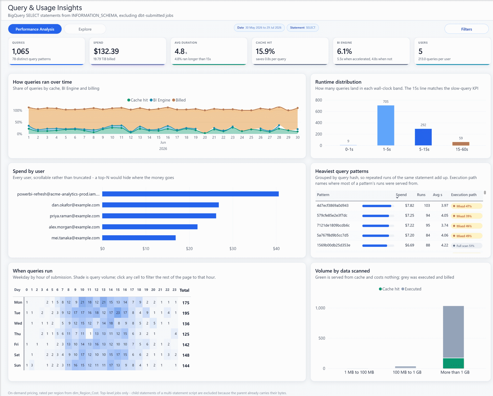
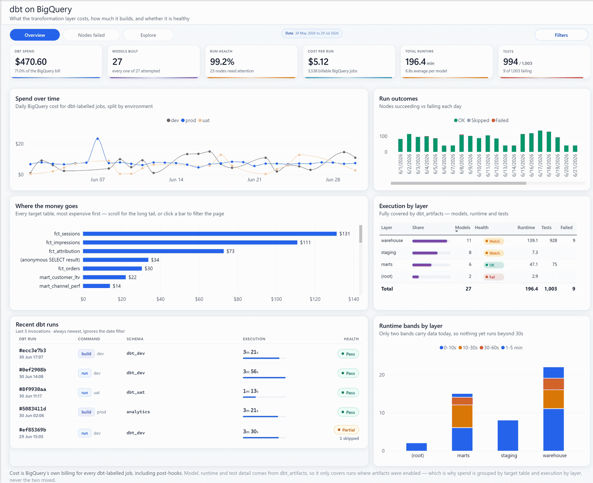
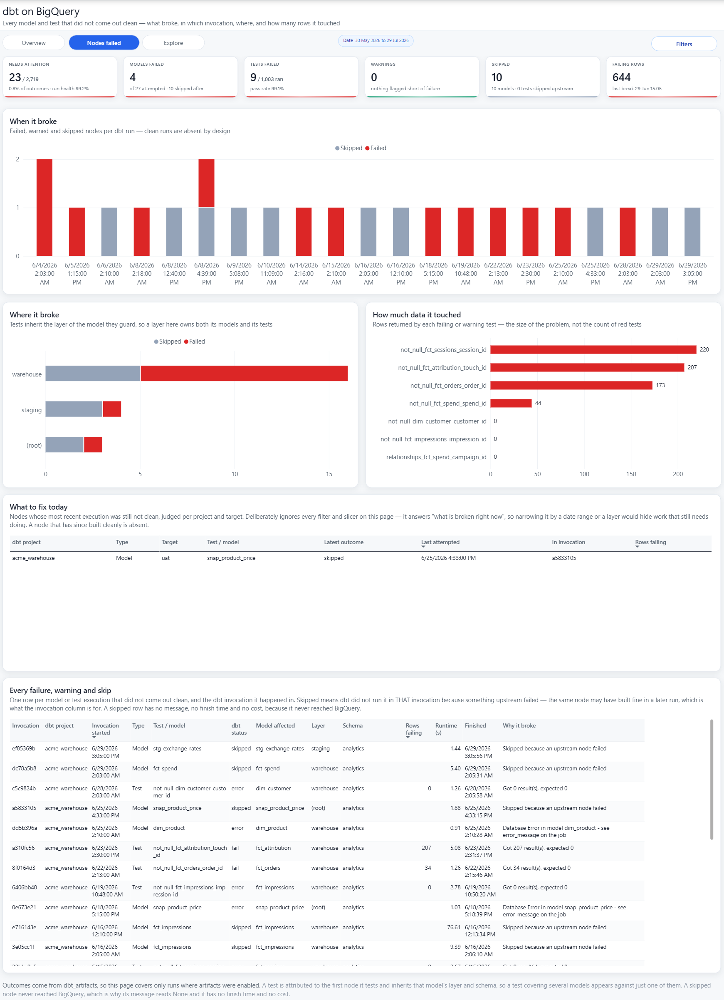

<!-- The hero doubles as the call to action. GitHub strips <iframe>, so the live
     report cannot be embedded in the page - it has to be a link out. The <h1>
     is real text, not pixels in the SVG, so the project name is something a
     search engine and a screen reader both get. -->
<a href="https://app.powerbi.com/view?r=eyJrIjoiYWUyY2IyOWQtNWVlOS00Y2JjLWI3MmMtZGE1N2ZhNDVhZDVjIiwidCI6IjExMWJhNTQ2LWQ1ZjQtNDgwYS05OGE3LWRmYjYzYjgzMGZiMSIsImMiOjEwfQ%3D%3D">
  <h1>BigQuery + dbt Cost Observability</h1>
  <picture>
    <source media="(prefers-color-scheme: dark)" srcset="assets/hero-dark.svg">
    
  </picture>
</a>

<p>
  
  
  
  
  
  
</p>

A Power BI semantic model over BigQuery's own job history. It answers two questions that cloud billing cannot: **where did the warehouse spend go**, and **which dbt model, snapshot, test or hook spent it**.

| | | |
|---|---|---|
| 🔎 | **[Part 1 · Query & Usage Insights](#-part-1)** | Everything running on the warehouse — who spends, on what, how long it takes, how much was cache, and which statements are worth rewriting. **No dbt required.** |
| 🧱 | **[Part 2 · dbt on BigQuery](#-part-2)** | The transformation layer — what each model costs, which runs are healthy, what broke, all joined back to BigQuery billing. Needs the **[dbt Template for BigQuery Cost Observability](https://github.com/methunt/dbt-bigquery-cost-observability-template)** wired up. |
| ▶️ | **[Part 3 · Run it yourself](#-part-3)** | Clone, set the parameters, refresh. Works offline against committed sample data. |

---

## 🎯 Where your money goes

<picture>
  <source media="(prefers-color-scheme: dark)" srcset="assets/strip-why-dark.svg">
  
</picture>

<br>

**Part 1** breaks the bill down by user, statement, region and hour; **Part 2** breaks it down by dbt model, snapshot, test and hook — including post-hook jobs that dbt's own metadata never records. In the sample month the **three most expensive target tables carry about two-thirds of the dbt bill**, and **service accounts outspend every human combined** — both one glance, not an investigation. Cache hits, BI Engine acceleration and the 10 MB billing floor each decide how much of the bill was avoidable, split further by `dev` / `uat` / `prod`, which is where surprises usually live.

---

<!-- EMBED:START -->
<a href="https://app.powerbi.com/view?r=eyJrIjoiYWUyY2IyOWQtNWVlOS00Y2JjLWI3MmMtZGE1N2ZhNDVhZDVjIiwidCI6IjExMWJhNTQ2LWQ1ZjQtNDgwYS05OGE3LWRmYjYzYjgzMGZiMSIsImMiOjEwfQ%3D%3D">
  <picture>
    <source media="(prefers-color-scheme: dark)" srcset="assets/cta-dark.svg">
    
  </picture>
</a>
<!-- EMBED:END -->

The pills, cross-filtering and drillthrough all work in it — it is the real report, on the same committed month of sample data. Prefer it locally, or want to point it at your own warehouse? See [Part 3](#-part-3).

---

## 🔌 How it is wired

<picture>
  <source media="(prefers-color-scheme: dark)" srcset="assets/architecture-dark.svg">
  
</picture>

Two live sources, one committed offline source, and a single parameter that switches between them. Every table honours `p_DataSource`, so one value takes the whole model from BigQuery to CSV and back.

---

<a id="-part-1"></a>

## Part 1 — Query & Usage Insights





> [!TIP]
> Every KPI carries a second number in its subtitle — the one you would otherwise have to go and find. Cache hit shows **the seconds it saves per query**; BI Engine shows **accelerated vs unaccelerated latency side by side**; average duration shows **the share of queries over 15s**.

### Performance Analysis — what each visual answers

| | Visual | The question |
|---|---|---|
| 📈 | **How queries ran over time** | Is the cache actually working? Cache hit, BI Engine and billed as a share of queries, so a regression shows up as a change in shape rather than a number you have to remember. |
| ⏱️ | **Runtime distribution** | Where wall-clock time lands — 0–1s, 1–5s, 5–15s, 15–60s. The 15s boundary is the same threshold as the slow-query KPI, so the two can never disagree. |
| 👤 | **Spend by user** | Who is spending. Every user, scrollable rather than top-N — a truncated list hides exactly the accounts you did not know about. Service accounts usually dominate, which is itself the finding. |
| 🔤 | **Heaviest query patterns** | Which *statements* cost money, grouped by query hash so repeated runs of the same SQL add up. A cheap query run 10,000 times outranks one expensive query, and only this grouping shows it. The **execution path** column names where the runs were served from — `Full scan`, `Mixed`, cache. |
| 🗓️ | **When queries run** | Weekday × hour of submission, shaded by volume. Click a cell to filter the whole page to that hour — the fastest way to explain a spike that only happens at 03:00. |
| 💾 | **Volume by data scanned** | Size bands split into cache-served (free) and executed (billed). Shows how much traffic is small queries paying the 10 MB billing floor. |

> [!NOTE]
> **Slow and expensive are different problems.** A query scanning 300 GB can finish in four seconds; one scanning 40 MB can take a minute. So runtime bands and slot time answer *how long*, billed bytes and per-region rates answer *how much*, and no visual on this page mixes the two.

### Slot hours

Slot time is a **metric** (`Slot Hours`, `Processed TiB`, `Billed TiB`) rather than a fixed visual, because slot consumption is only interesting sliced by something — user, pattern, hour. Pick the slice on Explore. The sample month runs **88.57 slot hours** against **102.26 TiB scanned**.

### Explore

The dimension and metric pills are field parameters: **19 dimensions × 23 metrics**, any combination, one grid. It exists so the answer to "can it show me X by Y" is yes without a new visual.

> [!IMPORTANT]
> **The two tabs have deliberately different scopes.** Worth knowing before you compare a number here against a number elsewhere and conclude something is broken.
>
> | Tab | Scope | Sample month |
> |---|---|---|
> | **Performance Analysis** | `SELECT` only, dbt jobs **excluded** | 1,065 queries · $132.39 |
> | **Explore** | every job, every statement type, dbt included | 4,894 jobs · $662.98 |
>
> Performance Analysis is about *interactive* usage — people and BI tools querying the warehouse. Scheduled dbt builds would swamp it, and are covered properly in Part 2. Explore drops both restrictions and says so in its own subtitle.

### Query pattern — drillthrough

Right-click any pattern or job and drill through to a single statement: the SQL with dbt's query comment stripped, its own KPI strip, and every job that executed it — newest first, with user, cache status, BI Engine status, seconds and spend per run. From there, right-click a row to reach the job itself.

> [!NOTE]
> Not screenshotted: a drillthrough page has nothing to render until you arrive with a selection. Open the report and right-click a row in **Heaviest query patterns**.

---

<a id="-part-2"></a>

## Part 2 — dbt on BigQuery


> [!TIP]
> Needs `dbt_artifacts` and job labels already wired up in your dbt project — the **[dbt Template for BigQuery Cost Observability](https://github.com/methunt/dbt-bigquery-cost-observability-template)** sets both up for you.



Same shape, different subject. In the sample month **$470.60 — 71.0% of the entire BigQuery bill — is dbt**, across 25 models, 2 snapshots and 1,003 test executions, at $5.12 per run.

### Overview

| | Visual | The question |
|---|---|---|
| 💸 | **Spend over time** | Daily dbt cost split by **environment** — `dev`, `uat`, `prod`. Non-prod spend that rivals prod is a common and expensive surprise, and it stays invisible unless you split on it. |
| 🟩 | **Run outcomes** | Nodes succeeding, skipped and failing per day. A wall of green with one grey column tells you where to look. |
| 🎯 | **Where the money goes** | Cost per **target table**, most expensive first, every table, scrollable. Click a bar to filter the page. |
| 🧱 | **Execution by layer** | `staging` / `warehouse` / `marts` / `snapshots` — nodes, a health chip, runtime, tests and failures per layer. Layers come from each model's file path, so this is dbt's own structure, not a tag you have to maintain. Snapshots are the one exception: they sit outside `models/`, so they are labelled `snapshots` rather than parsed. |
| 🧾 | **Recent dbt runs** | The last 5 invocations — command, target, execution time, health. Deliberately ignores the date filter, so it always answers "how did the most recent runs go". |
| 📊 | **Runtime bands by layer** | Whether slowness is spread across a layer or concentrated in a few models. |

> [!WARNING]
> **Cost is grouped by target table, execution by layer, and never the two together.** Cost comes from billing, layer comes from dbt metadata, and they do not fully overlap — a layer-keyed cost table puts most of the money in one blank row. See [Things that will bite you](#-things-that-will-bite-you).

### Nodes failed

Six KPIs put failure in proportion before you read a chart: **23 of 2,719** node outcomes needed attention — 3 models, 1 snapshot, 9 of 1,003 tests, 0 warnings, 10 skipped, **644 failing rows**.

| | Visual | The question |
|---|---|---|
| 🕒 | **When it broke** | Failed, warned and skipped nodes per dbt invocation. Clean runs are absent by design, so the axis is a list of incidents rather than a mostly-empty timeline. |
| 📍 | **Where it broke** | By layer. Tests inherit the layer of the **model they guard**, so a layer owns both its models and their tests — which is what makes a layer a useful unit of ownership. |
| 📏 | **How much data it touched** | Rows returned by each failing test. This is the size of the problem; a count of red tests is not. One test returning 220 rows outranks five returning one each. |
| 🔧 | **What to fix today** | Nodes whose *most recent* execution was still not clean. Ignores every filter and slicer on the page on purpose — it answers "what is broken right now", and narrowing it by date or layer would hide work that still needs doing. A node that has since built cleanly is absent. |
| 📋 | **Every failure, warning and skip** | One row per unclean execution *and the invocation it happened in* — because the same node may have built fine in a later run. Carries the reason, the rows failing, and the failing SQL one click away. |

<details>
<summary><b>Full-page screenshot — Nodes failed</b> (an unusually tall page, so it sits outside the tour above)</summary>



</details>

### Explore

The dbt equivalent of Part 1's Explore — **20 dimensions × 25 metrics**, including ones that only make sense here: cost per model, min-billing waste, rows written, success rate, models built per run. `Node Type` is among the dimensions, so any metric can be split model vs snapshot vs test.

### Attribution: three branches, ranked by confidence

<picture>
  <source media="(prefers-color-scheme: dark)" srcset="assets/attribution-dark.svg">
  
</picture>

| | Branch | How the match is made | Why it exists |
|---|---|---|---|
| 🟢 | **Node (dbt metadata)** | `job_id` from `adapter_response` on a recorded node execution | The precise route. Covers everything dbt itself ran. |
| 🟠 | **Node (label)** | the `model_name` + `resource_type` job labels | The **only** route to post-hook spend. Those jobs are separate submissions and never appear in dbt's run metadata. |
| ⚪ | **Run-level** | an invocation id, but no identifiable node | `run-operation`, `on-run-end` hooks, and jobs submitted without node labels. |

`is_dbt_job` — derived from the adapter's own invocation-id label, present on **every** job dbt submits — is the single definition of dbt scope, so it changes in one place. It deliberately does *not* key off the `app` label: that one is emitted only where a project explicitly configures it, so it silently omits jobs.

> [!CAUTION]
> Drop the label branch and **$89.70 of a $470.60 dbt bill becomes unattributable — 19.1%.**

---

<a id="-part-3"></a>

## Part 3 — Run it yourself



```bash
git clone https://github.com/methunt/PowerBi.git
cd "PowerBi/Bigquery & Dbt Cost Observability"   # quotes matter - the & is a shell operator
```

| 📦 **Sample data** — the default, no cloud account | ☁️ **Your own BigQuery + dbt** |
|---|---|
| 1. Open `powerbi/BigQuery dbt Cost Observability.pbip`<br>2. Set **`p_SampleDataPath`** to this folder's `sample-data`<br>3. Refresh<br><br>`p_DataSource` already defaults to `SampleCSV`. | 1. Set **`p_DataSource`** to `BigQuery`<br>2. Fill in the parameters below<br>3. Refresh and authenticate<br><br>Want **Part 1 only**? Set `bq_project` and `p_Regions` and refresh — the dbt pages stay empty, nothing errors. |

> [!IMPORTANT]
> **Prerequisite for 🧱 Part 2:** this report expects `dbt_artifacts` to be installed and the job labels described below to already be in place. **[dbt Template for BigQuery Cost Observability](https://github.com/methunt/dbt-bigquery-cost-observability-template)** is a companion dbt project that wires both up out of the box — start there if your dbt project does not yet emit them.

### Parameters

Every configurable value is an M parameter — nothing is hardcoded in a query.

| Parameter | Default | Set it to | Needed for |
|---|---|---|---|
| `p_DataSource` | `SampleCSV` | `BigQuery` to read live | both |
| `p_SampleDataPath` | *(local path)* | your clone's `sample-data` folder | sample mode |
| `bq_project` | `acme-analytics-prod` | the project whose jobs you want, and the billing project for the connection | both |
| `p_Regions` | `eu,europe-west3` | **every** region your project runs jobs in, comma-separated | both |
| `p_DbtMeta_Project` | `acme-analytics-prod` | project holding the `dbt_artifacts` tables | 🧱 Part 2 |
| `p_DbtMeta_Dataset` | `analytics` | dataset holding them — usually your dbt target schema | 🧱 Part 2 |
| `p_DbtMeta_Prefix` | `dbtmeta_` | the alias prefix on those tables, or `""` for default names | 🧱 Part 2 |
| `RangeStart` / `RangeEnd` | Jan–Aug 2026 | the incremental-refresh window on `Fact` | both |

> [!WARNING]
> **`p_Regions` is the one most likely to cost you money you cannot see.** Jobs only appear in the region they ran in, so a region left off the list is spend that is silently invisible. A region you lack access to is skipped rather than failing the refresh — convenient, and easy to miss.

### Prerequisites for BigQuery mode

**🔎 Part 1 needs only:**

- **`bigquery.jobs.listAll`** on the project, in every region in `p_Regions` — without it you see only your own jobs.
- **On-demand pricing.** The model prices bytes and excludes reserved jobs (`reservation_id IS NULL`): under a reservation you pay for slot capacity, not bytes, so including them would invent cost nobody was billed.
- Per-region rates live in **`dim_Region_Cost` as data**, not in DAX. Add a row per region; the `is_default` row is the fallback.

**🧱 Part 2 additionally needs:**

- **`dbt_artifacts`** installed and materialised in a dataset you can read, plus read access to it.
- **Job labels from dbt.** The BigQuery adapter stamps the invocation id natively. Model name and resource type come from your `query_comment` with `job-label: true`. Without them the label branch is empty and everything lands on run-level.

**Both parts need** these AppSource custom visuals: **Deneb** and **HTML Content**. The KPI strips, filter chips and one layered chart use them.

---

## 📚 Reference

Everything below is reference — read it when you need it.

<a id="-things-that-will-bite-you"></a>
### ⚠️ Things that will bite you

| | |
|---|---|
| **63-character labels** | dbt truncates label values at 63 characters and lowercases them, so long test names collide in `label_model_name`. The model name parsed from the query comment is not truncated, and is the fallback if this matters to you. |
| **No retroactive attribution** | Jobs submitted before you enabled job labels carry none, so they can only ever reach run-level. There is no backfill. |
| **Never put a run id in `query_comment`** | BigQuery's result cache keys on exact query text, comments included. A per-run value there turns every repeated query into a cache miss — and the adapter already gives you the invocation id as a label. |
| **Cost and layer do not fully overlap** | Cost comes from billing, `layer` from dbt metadata. Where a job has no matched node its layer is blank, which is why cost is grouped by target table and execution by layer, never both. Explore is the one place you can pair them, because there you have chosen to. |
| **`dim_Date` ends today** | Generated from `#date(2026,1,1)` to `DateTime.LocalNow()`, so a job dated in the future falls outside it and drops out of every date-driven visual. The sample data is a completed month for exactly this reason. |
| **Seeds are not covered** | The model reads `dim_dbt__models`, `dim_dbt__snapshots`, and the model, test and snapshot execution tables. dbt **seeds** live in their own `dbt_artifacts` table, which this model does not read, so they never appear as nodes. Their BigQuery jobs still count toward dbt spend — they carry the invocation label like anything else dbt submits — but they can only ever reach run-level attribution. |
| **A snapshot's tags are synthesized** | `dim_dbt__snapshots` records no tags array, so each snapshot is given one `snapshot` tag report-side purely to keep it reachable from the tag slicer. Whatever tags it carries in its dbt config are **not** here, so do not reconcile snapshot tags against the project. Its `layer` is likewise stated as `snapshots`, not parsed from the path. |
| **Snapshots report no rows written** | dbt records `rows_affected` as null on a snapshot even when its `MERGE` reports a row count in the message text, so snapshots are absent from **Rows Written** while still counted everywhere else. `bytes_processed` is null too — take a snapshot's bytes from the job, not from dbt. |
| **`(root)` is a layer, not a bucket for oddities** | `layer` is segment 1 of the model's path, so a model whose `.sql` sits directly in `models/` has no segment to take and shows as `(root)`. It means exactly that and nothing else. |

### 🧪 The sample data

One synthetic month — **2026-06-01 to 2026-06-30** — generated by [`scripts/generate_sample_data.py`](scripts/generate_sample_data.py) from a fixed seed. No production data was used; re-running the script reproduces the CSVs byte for byte.

| | | | |
|---|---|---|---|
| BigQuery jobs | **4,894** | Total spend | **$662.98** |
| — top-level / script children | 4,135 / 759 | — dbt / everything else | $470.60 / $192.38 |
| dbt invocations | 92 | models / snapshots / tests | 25 / 2 / 14 |
| dbt node executions | 2,719 | — model / snapshot / test | 1,590 / 126 / 1,003 |
| failed / skipped nodes | 13 / 10 | Slot hours | 88.57 |
| Regions | `eu`, `europe-west3` | | |

What is *not* random is the shape. A uniformly random dataset would hide the findings the report exists to surface, so the generator reproduces the structural facts deliberately: script children that bill, the 10 MB billing floor, cache hits that bill nothing, node coverage that is only partial, and rates that differ by region. Each is commented in the script with the reason.

The generator also asserts the invariants the model's relationships depend on — unique non-blank `job_id`, no orphaned executions, every node reaching a `dbt_models` row whatever its type, and each synthetic `no-job:` key matching the node type that produced it — and exits non-zero if any break. Those are refresh-stopping errors rather than wrong numbers, so they are worth catching before Power BI sees them.

```bash
python scripts/generate_sample_data.py   # rewrites sample-data/            (stdlib only)
python scripts/build_assets.py           # rebuilds the SVGs from summary.json
python scripts/build_page_assets.py      # crops captures, builds the tours  (Pillow + NumPy)
```

Every graphic that quotes a figure reads it from `sample-data/summary.json`, written by the generator — change the data and those graphics follow, so they cannot drift out of agreement. The dataflow diagram is the deliberate exception: it carries no figures at all, because its subject is the shape of the pipeline, and regenerating the sample month should not produce a diff in it.

### 📄 Licence

[MIT](LICENSE). The sample data is synthetic: no production data, table names or addresses appear anywhere in this repository.

### 📁 Repo layout

```
Bigquery & Dbt Cost Observability/
├─ powerbi/          the PBIP project — report + semantic model
├─ sample-data/      six CSVs and summary.json
├─ scripts/          data generator, SVG builder, screenshot/GIF builder
├─ assets/           animated SVGs (dark and light) and the page tours
└─ screenshots/      full-resolution page captures
```

<details>
<summary><b>Full-resolution stills</b></summary>

| Page | |
|---|---|
| 🔎 Query & Usage Insights | [png](screenshots/query-usage-insights.png) |
| 🔎 Query & Usage Insights · Explore | [png](screenshots/query-usage-insights-explore.png) |
| 🧱 dbt on BigQuery · Overview | [png](screenshots/dbt-jobs.png) |
| 🧱 dbt on BigQuery · Nodes failed | [png](screenshots/dbt-jobs-nodes-failed.png) |
| 🧱 dbt on BigQuery · Explore | [png](screenshots/dbt-jobs-explore.png) |

</details>
